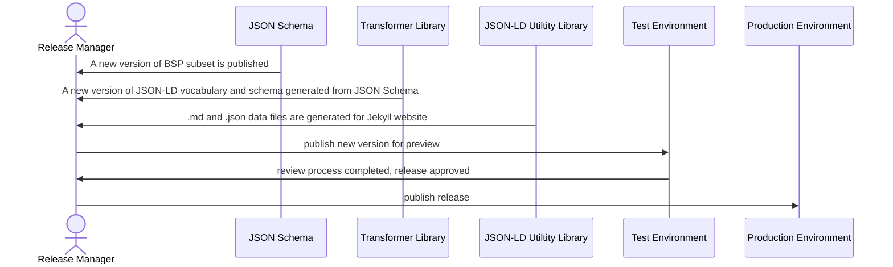

# Release management for UN/CEFACT vocabularies publication

## UN/LOCODE

UN/LOCODE JSON-LD vocabulary [about page](https://vocabulary.uncefact.org/unlocode-about)

When a new release is created in https://github.com/uncefact/vocab-locode repo, the [update-unlocodes.yml](https://github.com/uncefact/vocabulary-outputs/actions/workflows/update-unlocodes.yml) workflow is triggered.
It downloads the release artifacts (.jsonld files), calls the utility and generates md files along with csv data files.
Then it creates a pull request named `chore: update UN/LOCODEs vocabulary` with the draft flag set to true. If err.md is empty, that means there were no errors during md and csv files generation.
The pull request needs to be reviewed, config files updated to reflect the UN/LOCODE version changed. Config update triggers a deployment to a test endpoint.
When the pull request is merged into a main branch after being approved, the [release.yml](https://github.com/uncefact/vocabulary-outputs/actions/workflows/release.yml) is run manually.
It updates the static website content in the S3 bucket and the release is finished. 

## UN/CEFACT Web Vocabulary

UN/CEFACT Web Vocabulary [about page](https://vocabulary.uncefact.org/about)

[Transformer library](https://github.com/uncefact/spec-jsonld/tree/main/scripts) produces JSON-LD vocabulary and schema files from BSP subset published as [JSON schema](https://github.com/uncefact/spec-JSONschema/tree/main/JSONschema2020-12/meta-library/BuyShipPay). JSON-LD [utility library](https://github.com/uncefact/utilities/tree/main/jsonld-utility) generates md files along with json data files.
A release branch is created with version specific .jsonld, .md and .json data files and the [preview workflow](https://github.com/uncefact/vocabulary-outputs/blob/D23B-branch/.github/workflows/preview.yml) is manually triggerd to generate a Jekyll website and publish it on test environment for review. Once review is completed and the chenges are approved the release branch is merged to the master and the [release worklfow](https://github.com/uncefact/vocabulary-outputs/blob/D23B-branch/.github/workflows/release.yml) is manually triggerd to generate a Jekyll website and publish it on production environment. It updates the static website content in the S3 bucket and the release is finished. 

